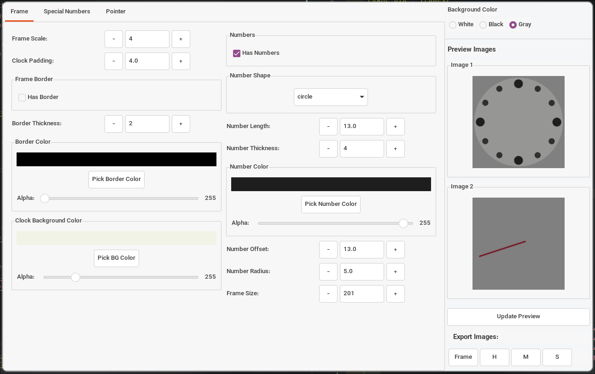
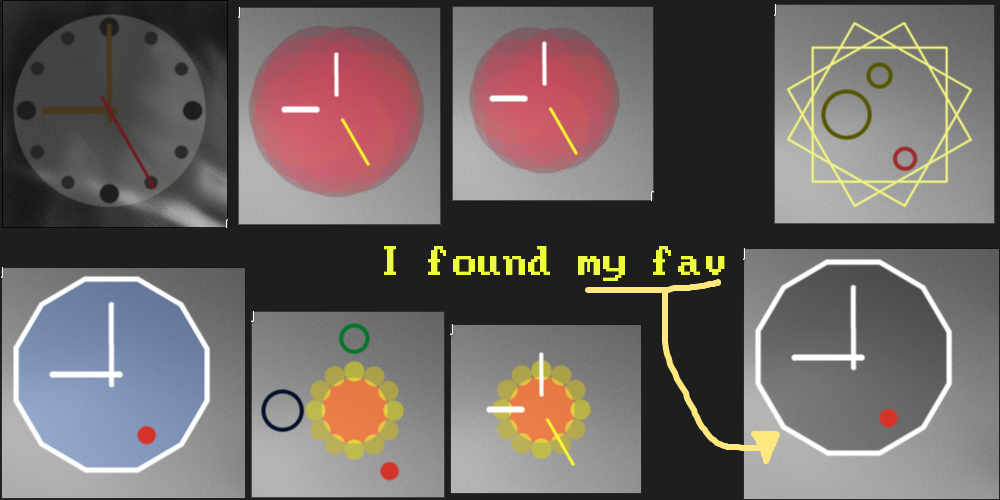
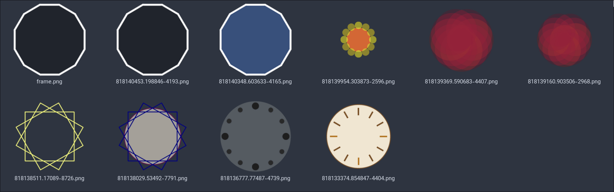
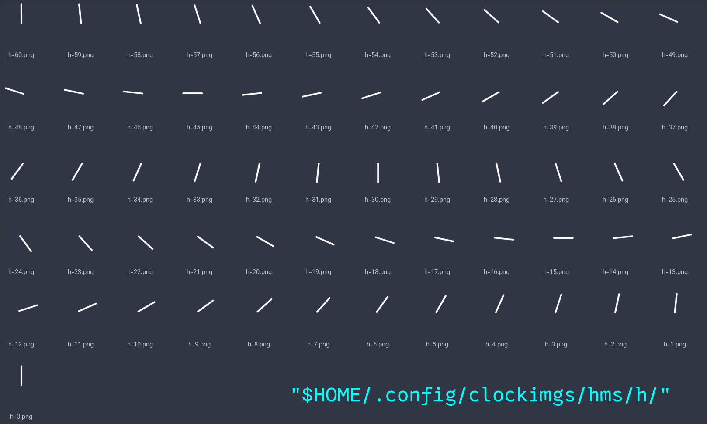

# Clock Maker

<div style="display: flex; justify-content: center; gap: 2%; margin-bottom: 2%;">
  
  
</div>

---

**A minimal Python tool (with Tkinter + Pillow) for generating clock pointer images. It renders 61 pointer images (minute 0 → 60) with fully customizable configs such as size, shape, thickness, colors and more.**

You can fully design your own hour, minute, and second pointers, then export them with a single click, ready to use in Eww or any other setup

---

### Run:

```sh
# Clone py-clock-maker
git clone https://github.com/TohidEq/py-clock-maker
cd py-clock-maker

# Open config.py and edit your default config if u want

# Install requirements
pip install -r requirements.txt

# Run the app:
python main.py
```

---

# More images

- Full example (EWW)

  

- Frame example resault

  

- Pointer example resault

  
